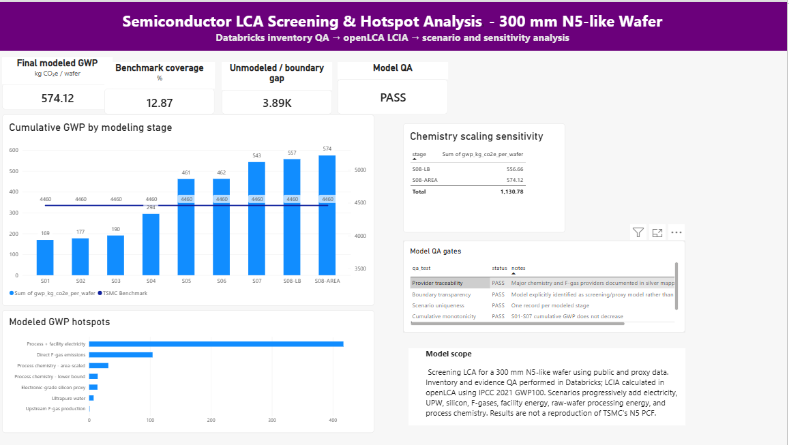

# Semiconductor LCA Screening & Hotspot Analysis

**300 mm N5-like wafer screening model using Databricks, openLCA, and Power BI**

## Project overview

I built this project to understand what can realistically be learned from a semiconductor LCA when the available data are incomplete, public, and partly proxy-based.

Rather than trying to reproduce a proprietary TSMC N5 product carbon footprint, I treated the work as a screening exercise. I added major inventory layers one at a time, checked how much each layer changed the result, and used the remaining gap to identify where the model was still missing important process or supply-chain information.

The workflow combines:

**public evidence → inventory QA in Databricks → provider mapping → LCIA in openLCA → scenario analysis → Power BI reporting**

## What I modeled

The model was built progressively around a 300 mm N5-like wafer.

| Scenario | Added modeling layer | GWP (kg CO₂e / wafer) |
|---|---|---:|
| S01 | Process electricity | 169.27 |
| S02 | Ultrapure water | 176.52 |
| S03 | Electronic-grade silicon proxy | 190.11 |
| S04 | Direct F-gas emissions | 294.11 |
| S05 | Facility / cleanroom energy | 461.20 |
| S06 | Upstream F-gas production | 461.77 |
| S07 | Raw-wafer processing-energy proxy | 542.69 |
| S08-LB | Process chemistry, lower-bound case | 556.66 |
| S08-AREA | Process chemistry, area-scaled sensitivity | 574.12 |

The area-scaled chemistry case reached **574.1 kg CO₂e per wafer**.

For context, I compared the modeled result with an external screening benchmark of **4,460 kg CO₂e per wafer**. The final modeled case therefore explains about **12.9%** of that benchmark.

I did not calibrate the model to close the remaining gap. I kept the gap visible because it reflects the limits of the modeled boundary and the public data available.

## What stood out

The largest modeled burden came from electricity-related loads.

Process electricity, cleanroom / facility energy, and the raw-wafer processing-energy proxy together contributed much more than the individual chemistry inputs.

Direct fluorinated-gas emissions were also important. One useful finding was the difference between **direct atmospheric release** and **upstream production of the gases themselves**. Upstream production of the fluorinated gases added only about **0.57 kg CO₂e per wafer**, while the direct emissions had a much larger effect on the result.

The chemistry block added less than I initially expected.

The lower-bound chemistry case increased the result to **556.66 kg CO₂e per wafer**, while the area-scaled case increased it to **574.12 kg CO₂e per wafer**. The difference between those two assumptions was about **17.46 kg CO₂e per wafer**.

That made the chemistry scaling assumption relevant, but not dominant.

Nitric acid was one of the more important individual contributors within the chemistry block.

## Modeling approach

### Databricks

I used Databricks to organize the inventory and keep the modeling logic traceable.

This included:

- inventory staging,
- provider-readiness mapping,
- scenario preparation,
- QA checks,
- result reconciliation,
- and Gold-layer views for Power BI.

The SQL used for the final inventory, openLCA result reconciliation, and reporting layer is available in:

`databricks/`

### openLCA

I used openLCA for the actual life-cycle impact calculations.

The model separates:

- technosphere inputs,
- direct elementary emissions,
- upstream production burdens,
- and foreground scenario assumptions.

The impact method used was:

**IPCC 2021 GWP100**

Final exported scenario results are available in:

`openlca/exports/`

### Power BI

I used Power BI to summarize the scenario progression and communicate the main hotspots.

The final dashboard includes:

- cumulative GWP by modeling stage,
- modeled hotspot contributions,
- chemistry sensitivity,
- model QA status,
- and the remaining benchmark gap.



## QA and model controls

I added several checks to avoid carrying errors from one scenario into the next.

The final QA layer checks:

- scenario uniqueness,
- cumulative monotonicity,
- provider traceability,
- chemistry sensitivity ordering,
- and boundary transparency.

All final QA checks passed.

A few modeling issues were also caught and corrected during the build, including:

- duplicate electricity loads,
- incorrect treatment of direct F-gas emissions,
- provider mismatches,
- and chemistry flows that did not have a defensible production provider.

These corrections were important because they materially changed the results.

## Important limitations

This is a **screening model**, not a verified product carbon footprint.

It does not use confidential fab-level process data and should not be interpreted as a reproduction of TSMC's N5 inventory.

The model relies on public and proxy data for:

- process electricity,
- cleanroom energy,
- fluorinated gases,
- raw-wafer processing,
- process chemistry,
- and selected material inputs.

Several advanced-node process and supply-chain burdens remain outside the modeled boundary.

The external benchmark is therefore used as a reference for **gap diagnosis**, not as a calibration target.

## Repository structure

```text
assets/
data/
databricks/
docs/
openlca/
LICENSE_NOTE.md
````

## What this project shows

This project reflects how I approach LCA work when the available data are incomplete:

* make the boundary explicit,
* separate measured data from proxies,
* document provider choices,
* test assumptions rather than hide them,
* keep QA visible,
* and avoid forcing the result to match an external benchmark.

It also shows how I combine LCA with data engineering and reporting tools rather than treating the calculation as a standalone exercise.

## Tools

**Databricks | SQL | openLCA | Power BI | Excel | IPCC 2021 GWP100**

```
